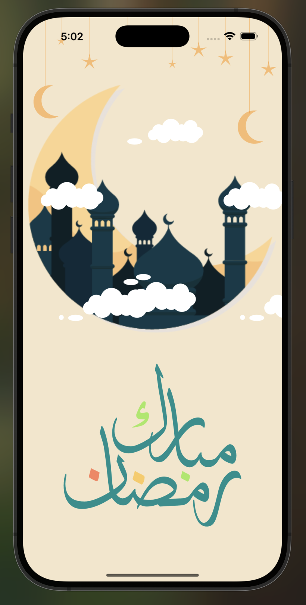

# Ramzan Mubarak

## Overview

Ramzan Mubarak is a Flutter application that displays a beautifully animated greeting screen for the holy month of Ramadan. It features smooth Lottie animations of a crescent moon, a mosque, and a festive Ramzan Mubarak text, creating a visually appealing and spiritual experience.

## Features

- **Crescent Moon Animation**: A Lottie animation of the moon and star at the top.
- **Mosque Animation**: A mosque animation representing the essence of Ramadan.
- **Ramzan Mubarak Text**: A festive greeting text with a non-repeating animation.
- **Minimalist UI**: A clean and elegant design with a warm background color.
- **Smooth Performance**: Uses Flutter **Stack** and **Positioned** widgets for a structured and responsive layout.

## Screenshot

Here's how the greeting screen looks:

